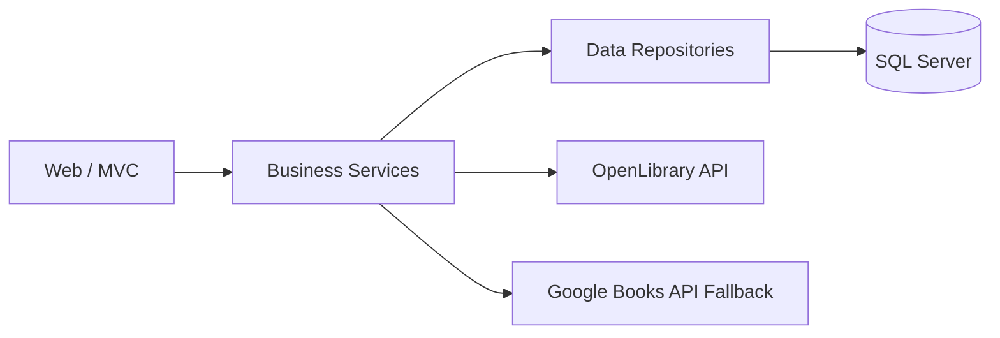

# Akıllı Kütüphane

Modern, katmanlı mimariye sahip bir **Kütüphane Yönetim Uygulaması**.  
Kullanıcılar kitap arayabilir, detay görebilir, favorilere ekleyebilir, puan verebilir ve kişiselleştirilmiş öneriler alabilir.

## Özellikler

- Kitap arama ve filtreleme (başlık/yazar)
- Kitap detay sayfası
- Kullanıcı kayıt/giriş (ASP.NET Core Identity)
- Favori ekleme/çıkarma
- 1-5 arası puanlama ve güncelleme
- "Puanlarım" ve "Favorilerim" sayfaları
- AI destekli öneri sistemi
- Admin panel (rol bazlı)
- Docker ile çalıştırma desteği
- Canlı dağıtım (ECR + App Runner + RDS SQL Server)

## Teknoloji Yığını

- **Backend:** ASP.NET Core MVC (.NET 9)
- **UI:** Razor Views + Bootstrap + Custom CSS
- **Veritabanı:** Microsoft SQL Server
- **ORM:** Entity Framework Core (Code First)
- **Auth:** ASP.NET Core Identity
- **Container:** Docker / Docker Compose
- **Cloud:** AWS (ECR, App Runner, RDS)

## Proje Yapısı

```text
AkilliKutuphane.sln
├─ AkilliKutuphane.Web        # Sunum katmanı (MVC, Identity, Views)
├─ AkilliKutuphane.Business   # İş kuralları, servisler, öneri motoru
└─ AkilliKutuphane.Data       # Entity'ler, DbContext, repository katmanı
```

## Mimari



## Hızlı Başlangıç (Lokal)

### Gereksinimler

- .NET SDK 9
- SQL Server (lokal veya container)
- Docker (opsiyonel)

### 1) Bağımlılıklar ve build

```bash
dotnet restore
dotnet build
```

### 2) Uygulamayı çalıştırma

```bash
dotnet run --project AkilliKutuphane.Web/AkilliKutuphane.Web.csproj
```

## Docker ile Çalıştırma

Bu projede `docker-compose.yml` ve `.env` yapısı hazırdır.

### 1) `.env` oluştur

`.env.example` dosyasını baz al:

```env
DB_SA_PASSWORD=CHANGE_ME_STRONG_PASSWORD
DB_NAME=AkilliKutuphaneDb
SQL_HOST_PORT=1434
WEB_HOST_PORT=8080
```

### 2) Compose ile ayağa kaldır

```bash
docker compose up --build -d
```

### 3) Erişim

- Uygulama: `http://localhost:8080`
- SQL Server (host): `localhost:1434`

## Konfigürasyon

Önemli environment variable'lar:

- `ConnectionStrings__DefaultConnection`
- `ASPNETCORE_ENVIRONMENT`
- `ASPNETCORE_URLS`

> Not: Production ortamında connection string ve şifreleri **env/secret manager** üzerinden verin.

## Canlı Dağıtım (AWS)

Projede canlı dağıtım için kullanılan ana bileşenler:

- **ECR**: uygulama image repository
- **App Runner**: web servis çalıştırma
- **RDS SQL Server**: veritabanı

Deployment akışı:

1. Image build et ve ECR'ye push et.
2. App Runner servisini güncelle (auto-deploy).
3. RDS bağlantısını `ConnectionStrings__DefaultConnection` ile ver.

## Önemli Notlar

- Kitap arama tarafında dış API sorunlarında (OpenLibrary timeout/500) fallback mekanizması aktiftir.
- Identity formları ve kullanıcıya görünen metinler Türkçeleştirilmiştir.
- Production bağlantı metni doğrulaması `Program.cs` içinde güvenlik amaçlı kontrol edilir.

## Kısa Değişiklik Geçmişi

- `v1` - Katmanlı mimari (Web/Business/Data), temel kitap/favori/puanlama akışları.
- `v2` - AI öneri sistemi ve kullanıcı bazlı dinamik öneri güncellemeleri.
- `v3` - Docker, Compose, Render/AWS dağıtım iyileştirmeleri ve production güvenlik sıkılaştırmaları.
- `v4` - Kimlik ekranları Türkçeleştirme, form kullanılabilirlik düzeltmeleri ve çoklu kaynak kitap arama fallback'i.

## Lisans

Bu depo için özel bir lisans belirtilmediyse varsayılan olarak "tüm hakları saklıdır".
